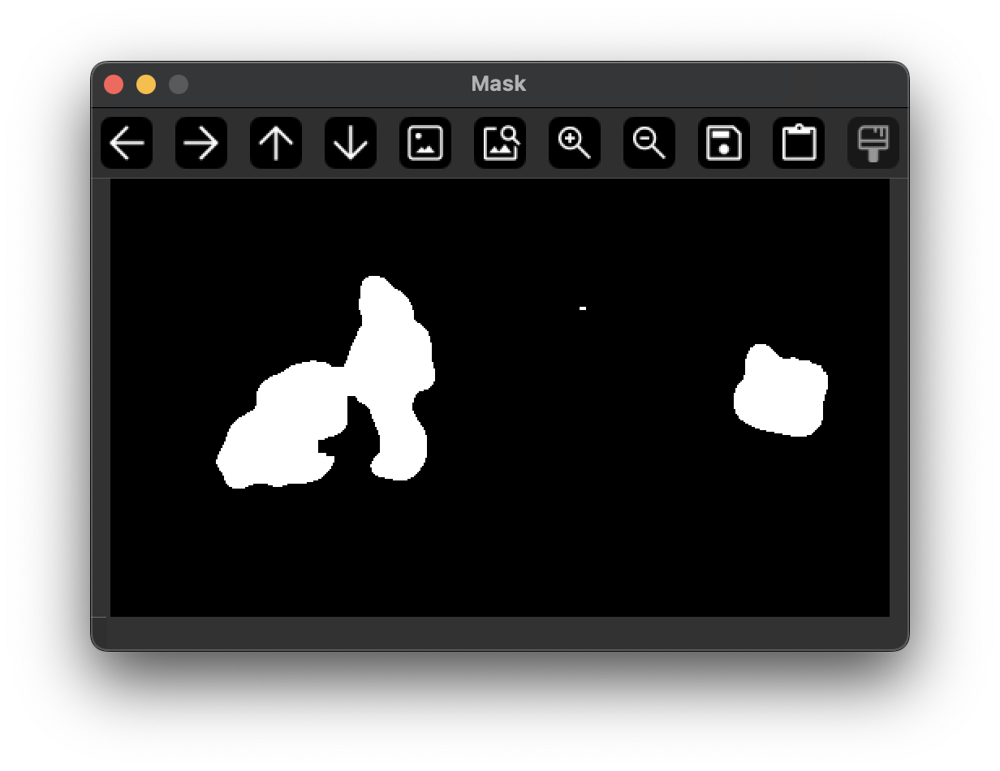

# Introduction
This project contains experiments in using OpenCV in Python and Rust programming languages.

## Objectives / Goals
Real-Time detection and classification of objects, using OpenCV, YOLO and LLama3.2-Vision. A lot of heavy-lifting is 
being done by that word 'real-time' - performance is incredibly important. AI models are computationally expensive and 
cannot and should not be run on every frame; so this project executes strategies to optimise for performance:

1. Do not do any detections until a frame has changed (MSE)
2. Detect motion (MOG2 + Adaptive Threshold + Love)
3. Filter out any motion detections which are not significant (e.g. too small, too short-lived etc).
4. For any remaining detect objects, crop them out of the image and run computationally expensive detections only on 
those so-called 'Regions Of Interest' (ROI)

**Example of MOG2 Mask Output**

The following image is an example mask produced by MOG2 Background Subtraction alongside additional processing:

