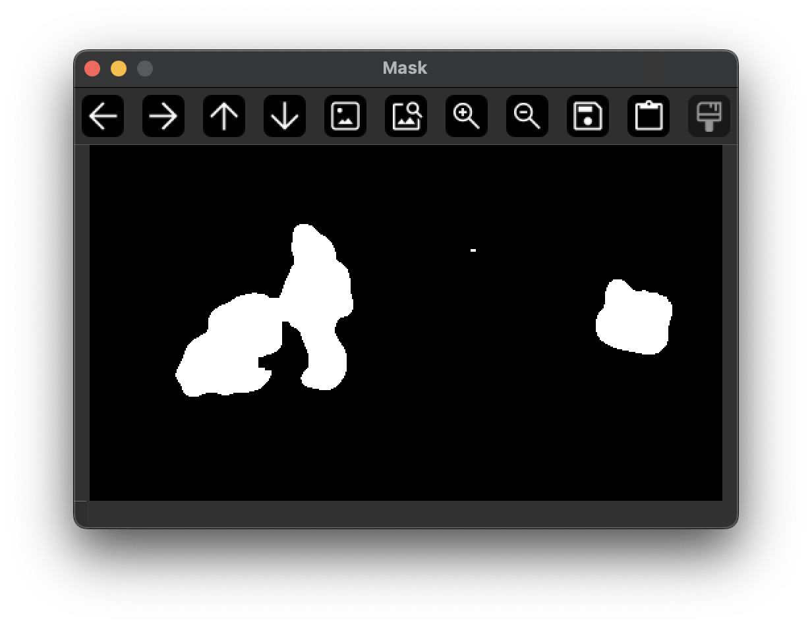

# Introduction
This project contains work-in-progress (WIP) code for experimenting with Computer Vision using OpenCV in Python. Little 
to no attempt will be made to keep this project up-to-date and as a result, the dependencies will probably eventually 
break and make you cry.

## Target Platform & Dependencies
While experimenting, the target platform is either Apple Silicon (M2 Max) -OR- Ubuntu Server 24.04.2 LTS.
For maximum performance, you will likely need to compile OpenCV for your target platform.

Dependencies are managed via [Anaconda](https://anaconda.org/anaconda/python).

## Objectives / Goals
Real-Time detection and classification of objects, using OpenCV, YOLO and LLama3.2-Vision. A lot of heavy-lifting is 
being done by that word 'real-time' - performance is incredibly important. AI models are computationally expensive and 
cannot and should not be run on every frame; so this project executes strategies to optimise for performance:

1. Do not do any detections until a frame has changed (MSE)
2. Detect motion (MOG2 + Adaptive Threshold + Love)
3. Filter out any motion detections which are not significant (e.g. too small, too short-lived etc).
4. For any remaining detect objects, crop them out of the image and run computationally expensive detections only on 
those so-called 'Regions Of Interest' (ROI)

## TL;DR
```bash
# setup your environment
conda env create -f environment.yml

# New hotness
python -m test.motion -i 'path/to/video.mp4'

# Old & busted
python -m deprecated.quick -i 'path/to/video.mp'
```

## FAQ
#### I want to read your code, where do I begin?
> Start with [./masks/motion_mog2.py](./masks/motion_mog2.py)
> 
> This class detects motion by creating masks with [MOG2 Background Subtraction](https://docs.opencv.org/4.x/d1/dc5/tutorial_background_subtraction.html)
> and then applying an [Adaptive Image Threshold](https://docs.opencv.org/4.x/d7/d4d/tutorial_py_thresholding.html) to reduce noise.
> To further increase quality, it also applies down-sampling, gaussian blur and other techniques such as erosion and dilation
> to improve the mask's image quality. Once a mask has been created, further processing can detect contours and create 
> bounding boxes etc.

**Example of MOG2 Mask Output**

The following image is an example mask produced by MOG2 Background Subtraction alongside additional processing:

